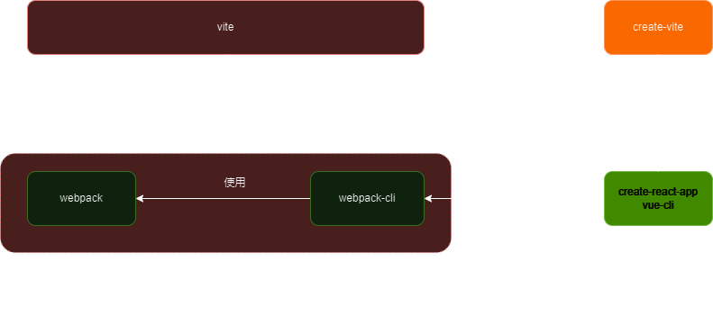
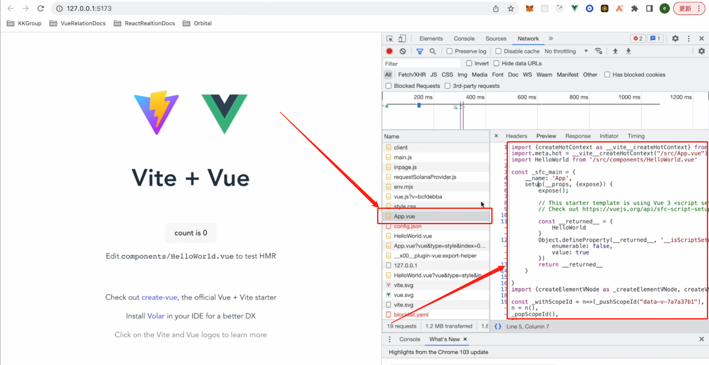

# vite-note
## 前置知识
### 构建工具
将各种工具如terser，babel，less，eslint等集成(把...集合起来构成自己的一部分)起来，然后按一定的顺序调用这些工具，把我们写的源代码打包成较高性能的html css js代码的东西
能够让我们不关心使用了什么多余的工具怎么转入源代码而只关心源代码内部的逻辑的工具

### 打包
将我们写的浏览器不认识的代码，如less，ts，jsx等，交给构建工具编译处理成浏览器可以认识的代码(html,css,js)的过程就是打包

### create-vite和vite的关系
1. 首先我们先说pnpm，yarn，npm的create指令
    我们使用pnpm create vite和yarn create vite的时候会首先安装create-vite到一个相当于全局的地方但是与正常的pnpm/yarn add create-vite -g是不同，这个命令会把create-vite这个库安装到一个缓存中(根据npm init、npm innit、npm create/npm exec、npm x/npx推测)，然后再执行这个缓存中的bin指向的可执行文件，并且把执行这个bin的时候的上下文塑造成 *和在敲pnpm/yarn create vite的目录下的上下文相同的上下文* 意思是
    ```shell
    D:\vite> pnpm create vite
    执行create-vite的时候相当于是
    D:\vite> pnpm run create-vite
    ```
    npm create vite和npm innit vite是npm init vite的别名，等同于npm exec create-vite --(这个--有什么用可以看npm的官网，这里不写--也没问题，但与后面的npx create-vite就不完全等价了)，等同于npx create-vite，这个命令会把create-vite这个库安装到某个缓存中，避免全局安装create-vite，然后和上面pnpm/yarn一样塑造出来一个“D:\vite>”的上下文执行create-vite的bin，相当于在执行npm run ...
    对npm详细的介绍可以看[npm中文文档](https://nodejs.cn/npm/cli/v7/commands/npm-exec/)，这个翻译的很好
2. create-vite对标的不是webpack-cli而是create-reacte-app和vue-cli
    

## 深入理解和使用vite
1. 都说vite只支持es module，细说这里面的内容
    1. 开发环境
        在开发环境下，vite会开启一个静态服务器，这是一个静态资源服务器，存在于这个静态资源服务器中的静态资源（尤其指js文件）是模块化的！！！
        什么意思呢？我们都知道现在的浏览器chrome是支持script标签模块化的，就是`<script type="module"></script>`中type="module"这个属性，如果不知道可以看看==文件夹“模块化浏览器”==
        这和vite只支持esm有什么关系呢？关系很大，vite在开发环境时使用的dev-server在对依赖文件进行构建的时候是默认依赖文件(我们自己写的文件和node_module文件)是esm的，如果这些文件是esm的，那么是不是浏览器本身就支持这些文件的模块化呢！！！！！所以vite要做的就是在html中往script标签上添加type="module"这属性就够了！！！！！这是不是很简单，比webpack在开启dev-server之前要把整个项目的依赖关系用自己的模块化进行一次改造要快的多的多（注：除webpack和vite之外的打包构建工具好像都不能使用dev-server，但是可以使用打包完成后就是npm run build之后开启一个服务器）
        但是vite在开启dev-server的时候也要注意不是只有`在html中往script标签上添加type="module"这属性这么简单`还要在我们内部项目引用node_module中的文件的时候，告诉浏览器去解析node_module中的文件，这个具体怎么实现的后面再说
        这个确实很快，但是有没有什么要求呢？要求就是你要是用能够支持esm模块化的浏览器去开发你的项目！！！！！
    2. 生产环境
        你在使用npm run build打包的时候，使用的就不是上面的模式了，而是使用rollup进行打包，因为rollup能把你的代码打包成不支持esm模块化的浏览器也能运行的代码，这个地方就考虑到了不能要求网站的用户使用的浏览器必须支持esm模块化的问题
        由于这里使用rollup进行build，但是rollup是只支持esm模块化引入的，源文件或者node_modules中的导出内容是可以使用cjs2进行导出的(想使用cjs2导出要使用插件，默认的rollup只支持esm的导入导出，但是插件让rollup可以把导出扩展到cjs2，但是导入还是要求是esm的导入！！！！！)，因为rollup是只支持esm模块化的，所以生产环境下vite也是只支持esm的模块化的
        注意：rollup打包的时候由于要支持`用户使用不支持esm模块化的浏览器的问题`，所以rollup和webpack一样要实现一套自己的模块化标准  
2. vite在开发模式下，就是npm run serve的时候如何让浏览器调用到node_module中的js代码
    先看文件夹==“模块化浏览器”==中的目录结构
    我们都知道浏览器支持的模块化是在js文件中可以使用import '/math.js'、import './math.js'(这里不存在import 'math.js' === import './math.js'的情况，也就是说不写./不会被认为是相对于当前路径，估计是node_modules引起的问题)或者import '../'但是不能直接import一个node_modules中的内容，对node_modules进行查找的规范是nodejs和webpack支持的，并不是浏览器支持的
    1. 为什么浏览器不支持
        既然esm是后于cjs2出现的，cjs2采用了查找node_modules的方式，那使用esm的浏览器为什么不支持这个东西呢？
        首先cjs2是使用在node中的，是使用在服务端的，它引用node_modules中的js文件是通过fs模块读取的
        然而esm的浏览器要想获取一个node_modules中的js文件的内容是要通过网络请求的，按照现在的node_modules的相互依赖关系，下载一个包的时候要同时下载好多吧的这种情况，会导致浏览器发出大量的网络请求去获取js文件，但是我们知道浏览器对于同一个域名能同时建立的tcp请求数量是有默认要求的chrome是6个，那么如果你还在使用http1.1，这个时候这6个连接要负责处理这些大量的请求，必然会有很多请求会被阻塞在这些http的连接中(因为http和tcp的队头阻塞等机制要求)，这样会大大降低页面的性能指标(首屏时间什么的都会有变慢的风险)，同时还会增加浏览器的压力
    2. vite和webpack是如何使浏览器支持的呢
        所以我们在index中使用import _ from 'lodash'的时候会出现问题，浏览器不能解析到lodash，如果vite只是简单的`在html中往script标签上添加type="module"这属`的话，这样就不能使用之前webpack的开发的模式了，因为浏览器认识我们源代码中的import _ from 'lodash'这种东西，但是对于我们自己写的代码还好，因为我们自己写的代码可以使用相对引用的方式进行开发，虽然我们程序员也可以使用直接在源代码中使用相对路径的方式引入我们想用的模块来解决这个问题，但是这就违背了vite的初衷(对比webpack要开箱即用)。所以为了能让我们按原来的开发方式进行开发，vite它也要把我们的代码进行转换，但是这种转换于webpack的转换不同，webpack会把我们的代码的模块化方式改成自己实现的模块化方式_webpack__require_，而vite则是只要对我们代码中的import的部分进行转换，如：import _ from 'lodash'改成 import _ from './lodash'，只转换这个就完了吗，当然不是，vite还要把lodash这个包的内容从node_modules中提取出来放到使用import _ from './lodash'引入lodash的文件的同级目录下，这样浏览器就能正常引入lodash了，但是这样还没完，lodash中引入的内容怎么办，lodash这个库里面的代码也是有使用像import dayjs from 'dayjs'这种方式引入的，浏览器还是不认识，所以vite还要把lodash中import的东西改成相对路径，然后把import的东西放到这个路径下。这样就会说了，那做这么多改变，vite凭什么比webpack快，那我们看看webpack是怎么处理node_modules的，webpack不是只读node_modules中每个库的开头的import字段然后修改，webpack是要把所有原来库文件中的导入导出按照自己的模块化来实现，所以webpack也是要处理node_modules，而且webpack处理node_modules的过程更加复杂耗时。
        其实本质上vite和webpack都要对所有的js代码进行编译和分析，但是vite比webpack要快的原因还有一个vite使用esbuild(也是一个前端模块化打包工具)来对js代码进行编译和分析，esbuild对js的编译器是go语言写的，而webpack也要对js代码进行编译和分析，但是webpack的编译器是node写的，node作为网络服务器处理IO密集型的事务很在行，比如，接受用户的网络请求进行回应，向数据库发送网络请求等待回应这种，但是node作为编译工具进行处理cpu密集型的事务就不在行
    2. vite让浏览器支持node_modules的具体实现
        在vite看到我们写的源代码里面是引用node_modules中的内容的时候，会对源代码的引入代码进行重写, 比如
        ```js
        // src源文件中
        import _ from 'lodash'
        ```
        vite会对上面的代码进行改写，改写成下面的样子
        ```js
        import _ from '/node_modules/.vite/lodash'
        ```
        这里的`/node_modules/.vite/lodash`路劲就可以正常的被浏览器解析了，但是node_modules文件夹下面没有.vite文件呀，哪里来的呢？
        答案就是vite创建的，vite会对原本node_modules中的lodash这个库进行处理然后放到自己创建的.vite文件夹下，这里引出了第二个vite做的事情，除了之前说的vite会改变我们源代码src中的引入代码，还会对node_modules中的库文件进行处理
        vite对node_modules中的库文件进行了什么处理呢？
        之前我们说到浏览器不敢支持node_modules的原因是，害怕引入层级过深，依赖树过于庞大，在加载一个库文件的时候要请求大量js文件(因为这个库文件还依赖着其他的库文件)，但是如果vite不对node_modules中的库文件进行任何处理，就是把node_modules中的库文件照搬到.vite文件夹下，首先，这个创建.vite的意义就没有了，vite完全可以直接把路径改成
        ```js
        import _ from '/node_modules/lodash'
        ```
        这种样式的，其次如果vite不对node_modules中的库文件进行任何处理，那么浏览器还是要在加载一个node_modules中的库的时候请求大量的文件，浏览器最怕的事情还是发生了，那怎么解决这种浏览器最怕的事情呢？那就是对node_modules中的库文件进行重写！！！这个过程叫做依赖预构建
        首先，vite会根据我们的源代码中的引入方式判断是引用的src中我们自己写的资源(js, css, ...)，还是引用的node_modules中的资源，如果是node_modules中的资源，vite会改写我们源代码中的引用路径，同时调用esbuild对这个库进行编译
        esbuild会把这个库及库中引入的内容打包到.vite文件夹下，这个时候就解决了浏览器最怕的问题，同时还解决了一个问题，就是我们引入的这些第三方的库可能不是使用esm模式进行模块化的，所以vite会使用esbuild来解决这个问题
        对上面的描述举个例子，比如我们在源代码中引入的就是lodash，那么vite检测到源代码要用这个lodash库了，vite就会调用esbuild这个库，把lodash中引入的所有的代码和lodash的代码打包成一个新的js文件然后存储到.vite文件夹下，并且通过esbuild完成模块化处理保证打包出来的这个新的js文件是esm的
        vite通过上面的方式解决了三个问题：1. 浏览器路径不识别；2. 外来库可能是非esm模块；3. 外来库会引入很多的其他包导致网络问题
3. 浏览器识别.vue文件的真相
    先来看一张.vue文件的截图
    
    大家可以看到浏览器解析的是.vue文件，不是html、css、js或者一些图片文件，但是有一个破绽虽然浏览器请求的是.vue文件，但是这条请求返回的却是js代码，所以我们可以初步估计，在命令行键入vite dev命令的时候，vite会开启一个开发服务器(相当于webpack-dev-server)，当浏览器请求一个.vue文件的资源的时候，这个本地的开发服务器会根据浏览器的请求从本地磁盘中读取这个浏览器请求的.vue文件(通过readFile命令)，然后通过vue的编译器把.vue文件中的内容转化成js代码，然后把这个.vue文件响应给浏览器。但是这个样子有个问题，浏览器拿到后缀为.vue的文件会很懵，他不知道怎么解析这个文件中的内容，浏览器也不知道开发服务器把这个文件中的内容变成js代码了，这时浏览器还是会报错，那怎么让浏览器不报错呢？就是让开发服务器在响应给浏览器这个.vue的文件的时候，同时告诉浏览器这里面是js代码，这个时候就要用到响应头Content-Type了。
    口说无凭我们来自己搭建一个开发服务器，这个服务器使用koa实现，但是vite是使用connect实现的开发服务器，因为connect对于处理CPU密集型的事务更有优势❓❓❓❓❓
    通过在命令行键入pnpm run start:devServer开启简易开发服务器，在浏览器中键入http://localhost:5173/查看结果
    ```js
    // 服务器代码
    const Koa = require('koa')
    const fs = require('fs')
    const path = require('path')

    const app = new Koa()

    app.use(async ctx => {
        console.log(ctx.request);
        // 用户在浏览器中键入http://localhost:5173/
        if(ctx.url === '/') {
            const indexHTML = await fs.promises.readFile(path.resolve(__dirname, '../client/index.html'))
            ctx.set('Content-Type', 'text/html')
            ctx.body = indexHTML;
        }
        // 响应的index.html中会通过script标签请求http://localhost:5173/js/main.js
        if(ctx.url === '/js/main.js') {
            const mainJS = await fs.promises.readFile(path.resolve(__dirname, '../client/js/main.js'))
            ctx.set('Content-Type', 'text/javascript')
            ctx.body = mainJS;
        }
        // 响应的main.js中会通过js代码(import App from './App.vue')请求http://localhost:5173/js/App.vue
        if(ctx.url === '/js/App.vue') {
            const AppVUE = await fs.promises.readFile(path.resolve(__dirname, '../client/js/App.vue'))
            // 使用vue的compiler对AppVUE进行编译，编译成js代码
            ctx.set('Content-Type', 'text/javascript')
            ctx.body = AppVUE;
        }
    })

    app.listen(5173, () => {
        console.log("开发服务器启动在5173");
    })
    ```
    上面显示的是服务器代码，这里的服务器路由使用硬编码的形式写的，仅供讲解使用
    ```html
    <!DOCTYPE html>
    <html lang="en">
    <head>
        <meta charset="UTF-8">
        <meta name="viewport" content="width=device-width, initial-scale=1.0">
        <title>Document</title>
        <!-- 注意这里的src是绝对路径，这里模仿的是vite打包出来的结果 -->
        <script type="module" defer src="/js/main.js"></script>
    </head>
    <body>
        index.html
    </body>
    </html>
    ```
    ```js
    // main.js
    // 注意这里的引入路径是相对路径，这里模仿的是我们写的src中的源代码打包出来的情况
    import './App.vue'
    ```
    ```js
    // App.vue
    // 模拟通过vue-compiler编译过后的.vue文件的样子
    console.log('App.vue')
    ```

# 使用vite
1. vite配置文件(vite.config.js)的语法提示
    1. 方式1：使用vite内部提供的函数
        ```js
        // vite.config.js
        // defineConfig就是vite为我们提供语法提示的一个函数
        const { defineConfig } = require('vite')

        module.exports = defineConfig({
            // 在这里写的属性会有提示
        })
        ```
        这个函数能实现提示的原因
        1. 实现方法1
            由于vite是使用ts写的，所以vite可以这样写defineConfig这个函数
            ```ts
            // vite.ts
            interface ViteOptionsInterface {
              input?: string;
              output?: OupPutInterface;
            }

            const defineConfig = (options: ViteOptionsInterface): ViteOptionsInterface =>
              options;
            ```
            然后整个vite项目在打包的时候，会使用tsc编译vite.ts文件生成一份vite.d.ts，供vscode使用
            这里说的“整个vite项目”指的是vite这个软件，vite这个库，打包出来给我们使用的vite的那个库
        2. 实现方法2
            使用jsDoc
            jsDoc是一个用于JavaScript的API文档生成器，类似于Javadoc或phpDocumentor。它可以将文档注释直接添加到源代码中，就在代码本身旁边。JSDoc工具可以将扫描源代码并为你生成一个HTML文档网站
            ```js
            // vite.js
            /**
             * @typedef {Object} OupPutInterface
             * @property {string} filename
             */

            /**
             * @typedef {Object} ViteOptionsInterface
             * @property {string} input
             * @property {OupPutInterface} output
             */

            /**
             *
             * @param {ViteOptionsInterface} options
             * @returns {ViteOptionsInterface}
             */
            const defineConfig = (options) => options;

            // 下面使用defineConfig的时候就会有参数和返回值的提示了
            ```
        本质上这两种方法在用相同的方法
    2. 方式2：使用jsDoc
        ```js
        // vite.config.js
        /**
         * @type import("vite").UserConfig
         */
        const viteConfig = {
            // 在这里写的属性会有提示
        }
        ```
2. 不同环境下使用不同的vite配置文件
    ```js
    // vite.config.js
    const { defineConfig } = require('vite')
    const viteBaseConfig = require('./config/vite.base.config')
    const viteProConfig = require('./config/vite.pro.config')
    const viteDevConfig = require('./config/vite.dev.config')

    // 策略模式(设计模式)
    const envResolver = {
        "build": () => Object.assign({}, viteBaseConfig, viteProConfig),
        "serve": () => Object.assign({}, viteBaseConfig, viteDevConfig)
    }

    // 这里不再写配置，而是写一些操作变量的内容
    module.exports = defineConfig(({commond}) => {
        // commond === "build" 生产环境
        // commond === "serve" 开发环境
        return envResolver[commond]()
    })
    ```
    ```js
    // ./config/vite.base.config.js
    const { defineConfig } = require('vite')

    module.exports = defineConfig({
        // 这里写基础配置
    })
    ```
    ```js
    // ./config/vite.pro.config.js
    const { defineConfig } = require('vite')
    
    module.exports = defineConfig({
        // 这里写生产环境的配置
    })
    ```
    ```js
    // ./config/vite.dev.config.js
    const { defineConfig } = require('vite')

    module.exports = defineConfig({
        // 这里写开发环境的配置
    })
    ```
    在使用vite命令的时候，怎么决定command传入的值是什么呢？
    在命令行直接敲vite，command的值就是"serve"
    在命令行敲vite build，command的值就是"build"
    webpack是通过 --env development或者 --env production的方式来指定的环境
3. vite.config.js里面可以使用esm规范
    ```js
    /** esm规范 */
    import { defineConfig } from "vite";
    import viteBaseConfig from "./config/vite.base.config";
    import viteDevConfig from "./config/vite.dev.config";
    import viteProConfig from "./config/vite.pro.config";

    const envResolver = {
        "build": () => Object.assign({}, viteBaseConfig, viteProConfig),
        "serve": () => Object.assign({}, viteBaseConfig, viteDevConfig)
    }

    export default defineConfig(({commond}) => {
        // commond === "build" 生产环境
        // commond === "serve" 开发环境
        return envResolver[commond]()
    })
    ```
    但是我们知道在node的环境下，只支持cjs2，node读到一个文件不是cjs2的规范就会报错
    首先我们要明确，vite这个库的代码中是通过require('vite.config.js')这种方式引入vite.config.js这个文件的，然后vite再使用node对继续处理各种东西，调用esbuild呀，依赖预构建呀什么的，vite这个库做的事情都是在node的环境下完成的
    那么如果在require('vite.config.js')时，vite.config.js里面用的时esm规范，node会不认识这个规范中的关键字，node会对这个js文件编译失败
    所以为了支持在vite.config.js里面写esm规范，vite在require('vite.config.js')这个文件之前先使用node的readFile库读取了这个vite.config.js文件并判断里面是不是cjs2的规范，如果不是就使用esbuild编译js文件的编译器把vite.config.js编译成ast然后使用ast把规范从esm规范转成cjs2规范；或者vite在node环境下(注意我这里不止一次强调是node环境)，直接使用esbuild编译js文件的编译器把vite.config.js编译成ast，再判断vite.config.js文件里面是不是cjs2的规范，如果不是直接使用ast把规范从esm规范转成cjs2规范。然后再通过require('vite.config.js')这种方式引入vite.config.js这个文件。
4. 环境变量
    vite内置了dotenv这个库对.env文件进行处理
    环境变量是什么？
    在公司中常见的几个环境：本地环境(开发环境)、测试环境、预发环境、线上环境
    每个环境可能要请求不同的后端接口地址(为的是线下数据和线上数据做到分离，不会互相影响)，这个时候我们就要根据不同的环境让这个存储着后端接口地址的变量有不同的值
    比如：
    ```js
    // 测试环境下
    const service = axios.create({
        baseUrl: "http://test.api.com"
    })
    // 生产环境下
    const service = axios.create({
        baseUrl: "http://pro.api.com"
    })
    ```
    在测试环境下axios实例的baseUrl为"http://test.api.com"，生产环境下axios实例的baseUrl为"http://pro.api.com"
    由于测试环境和生产环境都是要把代码部署到服务器的，所以当我们要把代码部署到测试环境的服务器之前，要先在源代码中把axios实例的baseUrl设置为"http://test.api.com"然后使用pnpm build打包出来部署代码，之后把部署代码部署到测试环境对应的服务器，交给测试同学去测试；而当我们的代码通过了测试之后，要上线到线上服务器了，这个时候我们要把源代码中axios实例的baseUrl改成"http://pro.api.com"，然后再次使用pnpm build打包，生成部署代码，然后把这个部署代码部署到生产环境对应的服务器
    这里存在一个比较大的隐患，那就是要改源代码中的axios实例的baseUrl的值，如果你忘记改了，这个时候岂不是有很大的问题，而且要通过改源代码的值的方式来进行环境的匹配的方式很不友好，如果后面来的程序员维护你这个项目，如果没有文档的话，他怎么维护这个项目
    所以我们要用一个统一的全局变量存储并控制源代码中axios实例的baseUrl的值，然后让一个"管家"向源代码中注入这个全局变量的值，还要让这个"管家"有能力根据不同的环境改变这个全局变量的值然后再注入，我们这里的管家就是vite。
    你可能要说了，这样不还是要改变全局变量的值吗？
    我们换一个思路，不去改变全局变量的值，而是把全局变量所有可能的值写好，比如写成一个对象，然后"管家"根据环境选择这个对象中不同的值来注入到源代码中，这样就解决了每次都要改全局变量的值的问题了，这是设计模式中常见的一种思路，软件迭代时尽量不改值而是通过加值的方式实现迭代，我们之前在说“不同环境下使用不同的vite配置文件”时使用的模式。
    举个简单的例子
    ```js
    const urlResolver = {
        'test': "http://test.api.com",
        'production': "http://pro.api.com"
    }

    // vite根据打包命令时传入的某个变量的值确定使用urlResolver哪个属性的值
    ```
    而在我们开发的时候是把这个全局变量有可能取到的值写入不同的文件中，vite根据环境的不同使用dotenv这个库读取不同的文件来实现取使这个全局变量的值不同，然后把这个全局变量注入到源代码中使用。
    为什么没有使用上面例子里面"对象的形式"并且直接在vite.config.js文件中定义而是要存储到一个单独的文件中，因为全局变量最好使用文件来维护，这个文件只负责声明和定义全局变量，那为什么不使用多个js文件来维护这些全局变量，而是要使用.env，因为这些环境变量多是字符串，所以.env文件可以很好的保证他们不会被改值，如果是使用js文件配合cjs2规范导入导出的话，这个js文件里面的值是可以更改的, 为了不可变性，所以使用了.env文件，其实这也是一种约定俗成，大家都这么用
    那么vite如何读取.env.\*文件呢？.env.\*文件的配置都是什么呢？
    ```py
    # env/.env
    # 这.env文件中的变量不管在什么环境下都会被vite读取，并注入到源代码中
    # 如果.env.*的文件中定义了同名变量，那么.env文件中定义的变量将被覆盖
    PROJECT_NAME = VITE_NOTE

    # env/.env.production
    BASE_URL = http://pro.api.com

    # env/.env.test
    BASE_URL = http://test.api.com
    
    # env/.env.development
    BASE_URL = http://mock.api.com
    ```
    ```js
    // vite.config.js
    export default defineConfig(({commond, mode}) => {
        // commond === "build" 生产环境
        // commond === "serve" 开发环境
        const config = envResolver[commond]()

        // 通过vite提供的loadEnv方法来加载.env.*的文件中的内容
        // vite内部会在不管是通过dev还是在build命令启动的时候，都会自动调用loadEnv这个方法来将环境变量注入到项目中
        // loadEnv这个命令是vite会自动调用的，我们在这里手动调用会阻止vite的自动调用，通过我们手动调用的方式process.env上面就会加上loadEnv函数解析出来的值
        // loadEnv这个方法内部会使用dotEnv这个库
        // dotEnv会把.env.*的文件中的符合loadEnv第三个参数规则的环境变量写入到process.env这个对象中，成为这个对象的属性。什么是符合loadEnv第三个参数规则？我们一会儿就说
        // 然后vite会再通过一些他自己的规则，对process.env中的属性进行筛选然后注入到我们的源代码中，马上我们就能看到规则了, 这个规则与loadEnv的第三个参数息息相关
        // 特别注意：vite不会把process.env提供给我们的源代码使用，这一点和webpack不同，就像上面一句话说的"vite会通过一些他自己的规则向我们的源代码中注入环境变量", 而webpack是通过process.env向我们编写的源代码中提供所有的环境变量的❓❓❓❓❓❓

        /**
         * .env                # 所有情况下都会加载
         * .env.local          # 所有情况下都会加载，但会被 git 忽略
         * .env.[mode]         # 只在指定模式下加载
         * .env.[mode].local   # 只在指定模式下加载，但会被 git 忽略
         */
        /**
         * param1: 用dotEnv读取.env文件和.env.${param1}文件中的环境变量注入到process.env中
         *         如果.env文件和.env.${param1}文件有同名的环境变量，那么会取.env.${param1}文件中环境变量的值
         * param2：.env文件和.env.${param1}文件都存储在哪个目录(文件夹中)下
         * param3：表示.env文件和.env.${param1}文件中以${param3}开头的环境变量才会被vite使用dotEnv这个变量进行读取，并加载到process.env中
         *          这个参数如果不传，默认是"VITE", 如果想让.env文件和.env.${param1}文件中的所有环境变量都加载到process.env中就要在这里传入""
         * return：返回process.env
         */
        const env = loadEnv(mode, /** 可以使用process.cwd() */ path.resolve(__dirname, './env'), "")

        return config
    })
    ```
    这个配置文件中有一个关键点mode这个参数是哪里来的？
    vite官方有这样的解释
    > 默认情况下，开发服务器(dev命令)运行在development(开发) 模式，而build命令则运行在production(生产)模式。
    > 这意味着当执行vite build时，它会自动加载.env和.env.production中可能存在的环境变量
    所以我们在命令行使用vite dev命令的时候mode就等于development了；在命令行使用vite build命令的时候mode就等于production了
    如果我们想自由规定mode的值，可以
    > 在某些情况下，若想在vite build时运行不同的模式来渲染不同的标题，你可以通过传递--mode选项标志来覆盖命令使用的默认模式。例如，如果你想在staging（预发布）模式下构建应用, 可以在命令行键入vite build --mode staging，这样mode的值就是staging了
    > 因为mode的值为staging，vite还会自动加载.env和.env.staging中可能存在的环境变量
    在我们的源代码中如何使用vite解析.env.*之后获得的环境变量呢？
    ```js
    // src/api/service.js
    import axios from 'axios'

    // vite会把解析.env.*之后获得的环境变量放入import.meta.env对象中，给我们的项目源代码使用
    const {BASE_URL} = import.meta.env

    const service = axios.create({
        baseURL: BASE_URL   // ""
    })

    export default service
    ```
    但是只做到这里其实vite并没有把环境变量注入到import.meta.env中, 就是BASE_URL的值是空字符串"", 这是因为vite只会把.env.\*中的以VITE开头的变量注入到import.meta.env，所以我们还需要对.env.\*中想要注入的环境变量进行更改，加上VITE前缀，通常我们会加上VITE_作为前缀，使得变量名便于理解
    ```py
    # env/.env
    VITE_PROJECT_NAME = VITE_NOTE

    # env/.env.production
    VITE_BASE_URL = http://pro.api.com

    # env/.env.test
    VITE_BASE_URL = http://test.api.com
    
    # env/.env.development
    VITE_BASE_URL = http://mock.api.com
    ```
    之后我们再在我们的源代码中使用环境变量VITE_BASE_URL就能用了
    ```js
    // src/api/service.js
    import axios from 'axios'

    // vite会把解析.env.*之后获得的环境变量放入import.meta.env对象中，给我们的项目源代码使用
    const {BASE_URL} = import.meta.env

    const service = axios.create({
        baseURL: BASE_URL   // "http://test.api.com"
    })

    export default service
    ```
    到底怎么回事儿呢？说了这么半天怎么这么乱呢？
    现在我们就把它捋清楚，在此之前我们先说两个问题：1. 还记的我们在之前的注释里面说的vite的规则吗？答案就是vite只会把.env.*中的以VITE开头的变量注入到import.meta.env；2. 还记得我们自己调用的dotEnv的第三个参数吗？他的默认值是"VITE"!!!
    实例：当我们在命令行键入vite build --mode test的时候会发生什么？
    首先vite会在内部自动调用
    ```js
    // 从这里可以看到，如果我们的.env文件不在 process.pwd()指向的目录下的话，还是要通过我们手动调用loadEnv函数加载环境变量
    loadEnv("test", process.pwd(), "VITE")
    ```
    这个函数的语义是：
    在process.pwd()文件夹下的 .env文件、.env.local文件、.env.test文件以及.env.test.local文件中的 以VITE开头的环境变量 会被注入到process.env中
    我在这里提取出这三个限制条件
    > 在process.pwd()文件夹下的
    > .env文件、.env.local文件、.env.test文件以及.env.test.local文件中的
    > 以VITE开头的环境变量
    然后vite就会通过内置规则来从process.env中筛选属性，注入到import.meta.env中，这个规则默认是
    在process.env中的 属性名以VITE开头的属性 会被注入到import.meta.env中
    我在这里提取出这两个限制条件
    > 在process.env中的 
    > 属性名以VITE开头的属性
    所以vite在为我们的源代码中注入环境变量的时候是经过层层筛选的
    那我们能不能改变vite从process.env中筛选属性的筛选规则呢？
    可以，通过在配置文件中配置envPrefix属性，这个属性的值的类型是`string | string[]`
    ```js
    // config/vite.base.config.js
    const { defineConfig } = require('vite')

    module.exports = defineConfig({
        // 这里写基础配置
        envPrefix: "pokemao"
    })
    // 这个文件中的配置会被merge到vite.config.js中
    ```
    如果改变了envPrefix的值，那么vite在一开始自动调用loadEnv函数的时候传入的第三个参数的值也会有变化
    ```js
    loadEnv("test", process.pwd(), "pokemao")
    ```
    通过配置envPrefix的值改变了我们之前说的两个规则
    规则1变成了
    > 在process.pwd()文件夹下的
    > .env文件、.env.local文件、.env.test文件以及.env.test.local文件中的
    > 以pokemao开头的环境变量
    规则2变成了
    > 在process.env中的 
    > 属性名以pokemao开头的属性
    让我们把vite自动调用loadEnv写的更加泛化一些
    ```js
    loadEnv(mode, process.pwd(), envPrefix)
    ```
    我们之前说过在我们自己调用loadEnv函数的时候，loadEnv函数的第三个参数与vite从process.env中筛选属性的筛选规则envPrefix息息相关，为什么这么说呢？
    从使用上看loadEnv函数的第三个参数必须是vite从process.env中筛选属性的筛选规则的超集(loadEnv函数的第三个参数也可以是数组)，如果不是超集就会出现loadEnv函数没有把vite想筛选的环境变量注入到process.env中的现象，loadEnv函数注入到process.env中的环境变量都是vite不需要的或者说和vite的envPrefix不匹配的
    如果我们像上面一样改变了vite配置文件中envPrefix的值的话，我们也要改变一下.env.*文件中环境变量的前缀了
    ```py
    # env/.env
    pokemao_PROJECT_NAME = VITE_NOTE

    # env/.env.production
    pokemao_BASE_URL = http://pro.api.com

    # env/.env.test
    pokemao_BASE_URL = http://test.api.com
    
    # env/.env.development
    pokemao_BASE_URL = http://mock.api.com
    ```


# webpack关注兼容性node和web的开发，vite只关注web的开发
# vite对比webpack的优势
1.  上手简单，把webpack的大部分loader基本上内置了，不用手动配置，对新手友善 
2.  pnpm start的时间很短，原因是vite只使用import模块化，即：vite只能用于支持`<script type="module"></script>`的浏览器，所以vite不需要对所有的js文件进行模块化转化；对比webpack，他要把import和require的两种规范转化成自己的webpack_require规范，从而对import和require的模块化都做支持，这种转换势必要花费大量的时间


# vite对比webpack的劣势
1.  vite只能用于支持`<script type="module"></script>`的浏览器，就是支持esmodule模块化的浏览器，但是webpack支持所有类型的浏览器，因为webpack的模块化是webpack自己提供的
2. 和上一条的原因相似，webpack支持多种模块化(import和require), vite只使用import模块化也就是es module模块化

